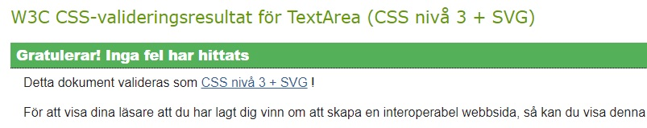
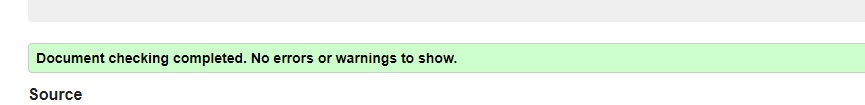

# Nerd Alert - Front end

Nerd Alert is for all the people who love to play computer/video games and that want a community where they can find likeminded people. Loggged in users can share pictures from their favourite game or why not movie and rate, comment on other peoples posts. This is the frontend of the webpage. The backend API is found here: https://github.com/Kimskogfelter/pp5-drf-nerd-alert


### Site Goals

Nerd Alert is for all the nerdy people out there who wants to find likeminded people to share their love for nerdy things. The main category is computer/video games but people can also share a movie related to a specific video game, or why not a 3D printed stand for your gaming controllers that reminds you of Zelda. Maybe you want help to find the next game to play? A movie for the geek night with your friends? Or help to find the best headset for your gaming computer? Only your imagination sets the limits of what you want to share.
<hr>

### Agile Planning

I used a kanban board when developing this project to help me track each of the steps I needed to take to complete this website.

During the development of the webpage I deleted all the stories I found not necessary to keep in the websise so I only could focus on the ones I really needed.

The Kanban board was created using github projects and can be located [here](https://github.com/users/Kimskogfelter/projects/6/views/1).

<hr>

### Epics


**Posts**

This epic is about the front end application where the users can create, read, update and delete their own posts. 

**Comments**

This epic is about the front end application where the users can create, read, update and delete their own comments and add a star rating to the related post. 

**Profiles**

This epic is about the front end application where the users can create, read, update and delete their own profiles.  

**Favourites**

This epic is about the front end application where the users can favourite certain posts they like and find them under the favourites category when they are logged in.

**Contact Page**

This epic is about the front end application where the users can choose to contact the administration of the webpage through a form if they got any questions.


<hr>
<br>

### User Stories

By Epic:

**Home**

* As a user I can keep scrolling through the images on the site, that are loaded for me automatically so that I don't have to click on "next page" etc
* As a user I can see a list of the most followed profiles so that I can see which profiles are popular
* As a user, I can search for posts with keywords, so that I can find the posts and user profiles I am most interested in
* As a logged in user I can follow and unfollow other users so that I can see and remove posts by specific users in my posts feed
* As a user I can navigate through pages quickly so that I can view content seamlessly without page refresh

**Authentication** 

* As a user I can sign in to the app so that I can access functionality for logged in users
* As a user I can tell if I am logged in or not so that I can log in if I need to
* As a user I can maintain my logged-in status until I choose to log out so that my user experience is not compromised
* As a user I can create a new account so that I can access all the features for signed up users

**Navigation menu**

* As a user I can view a navbar from every page so that I can navigate easily between pages
* As a logged out user I can see sign in and sign up options so that I can sign in/sign up

**Posts**

* As a logged in user I can create posts so that I can share my images with the world!
* As a user I can view all the most recent posts, ordered by most recently created first so that I am up to date with the newest content
* As a user I can view the details of a single post so that I can learn more about it
* As a post owner I can edit my post title and description so that I can make corrections or update my post after it was created
* As an owner of a post I can delete my post so that I can control removal of my post from the application
* As a user I can view all the posts by a specific user so that I can catch up on their latest posts, or decide I want to follow them
* As a logged in user I can view content filtered by users I follow so that I can keep up to date with what they are posting about

**Comments**

* As a user I can view the posts page so that I can read the comments about the post
* As an owner of a comment I can delete my comment so that I can control removal of my comment from the application
* As a user I can read comments on posts so that I can read what other users think about the posts.
* As a logged in user I can add comments to a post so that I can share my thoughts about the post.
* As a user I can see how long ago a comment was made so that I know how old a comment is
* As an owner of a comment I can edit my comment so that I can fix or update my existing comment with the text.

**Profiles**

* As a user I can view other users profiles so that I can see their posts and learn more about them
* As a logged in user I can update my username and password so that I can change my display name and keep my profile secure
* As a logged in user I can edit my profile so that I can change my profile picture and bio
* As a user I can view statistics about a specific user: bio, number of posts, follows and users followed so that I can learn more about them
* As a user I can view user's avatars so that I can easily identify users of the application

**Favourites**

* As a logged in user I can favourite a post so that I can show my support for the posts that interest me
* As a logged in user I can view the posts I have marked as a favourite so that I can find the posts I enjoy the most

**Contact Page**

* As a user I want to be able to contact the webpage if I got any questions


<hr>
<br>

### Features:

**Home**

USER STORIE NR# 18:

`As a user I can keep scrolling through the images on the site, that are loaded for me automatically so that I don't have to click on "next page" etc`

Implementation: 

As a user it is a nice experince to dont have to click on a button to continue to see more of the content. 
To be able to scroll when you want to see more gives the user a good experience. 

Link to user storie: https://github.com/users/Kimskogfelter/projects/6/views/1?pane=issue&itemId=64716942


USER STORIE NR# 9:

`As a user I can see a list of the most followed profiles so that I can see which profiles are popular`

Implementation: 

As a user it is a nice experince to see the most popular profiles to see if someone of them offers something they would like to follow too.

Link to user storie: https://github.com/users/Kimskogfelter/projects/6/views/1?pane=issue&itemId=64716120


USER STORIE NR# 21:

`As a user, I can search for posts with keywords, so that I can find the posts and user profiles I am most interested in.`

Implementation: 

As a user it is a nice experince to be able to search for a specific topic to find what you are looking for without having to search the entire website.
This is being done with the searchbar at the top of the webpage under the header.

Link to user storie: https://github.com/users/Kimskogfelter/projects/6/views/1?pane=issue&itemId=64717112


USER STORIE NR# 7:

`As a logged in user I can follow and unfollow other users so that I can see and remove posts by specific users in my posts feed`

Implementation: 

As a user it is a nice experince to be able only see the content of the profiles you follow in its own page. So when a user choose to follow a profile and click the 
feed menu in the navigation bar they will get to a page which only shows posts from the users they have choosen to follow. 

Link to user storie: https://github.com/users/Kimskogfelter/projects/6/views/1?pane=issue&itemId=64715989


USER STORIE NR# 32:

`As a user I can navigate through pages quickly so that I can view content seamlessly without page refresh`

Implementation: 

As a user it is a nice experince to be able to navigate through different pages quickly without having to wait for the page to refresh. This is being done
by a refresh token. 

Link to user storie: https://github.com/users/Kimskogfelter/projects/6/views/1?pane=issue&itemId=64717935


**Authentication**

USER STORIE NR# 30:

`As a user I can sign in to the app so that I can access functionality for logged in users`

Implementation: 

As a user it is a nice experince to be able to create a user for the webpage to be able to get access to certain functions like favourite a post. To later be able to log in and
find all the posts you have choose to favourite. This is being created by clicking on the  heart next to a posts when logged in. That post is then saved to the favourites page, which the user can reach by clicking on the favourites menu in the navigation bar.

Link to user storie: https://github.com/users/Kimskogfelter/projects/6/views/1?pane=issue&itemId=64717737


USER STORIE NR# 29:

`As a user I can tell if I am logged in or not so that I can log in if I need to`

Implementation: 

As a user it is a nice experince to be able to see if you are logged in or not the webpage. When a user is logged in they can see the Sign out menu at the navigation bar. If the user is not logged in they can see the Sign in menu insted. 

Link to user storie: https://github.com/users/Kimskogfelter/projects/6/views/1?pane=issue&itemId=64717686


USER STORIE NR# 28:

`As a user I can maintain my logged-in status until I choose to log out so that my user experience is not compromised`

Implementation: 

As a user it is a nice experince to be able to stay logged in for as long as you want to. This is being done by having a refresh token.

Link to user storie: https://github.com/users/Kimskogfelter/projects/6/views/1?pane=issue&itemId=64717641

USER STORIE NR# 31:

`As a user I can create a new account so that I can access all the features for signed up users`

Implementation: 

As a user it is a nice experince to be able to create your own user for the webpage to get access to all the features a logged in user gets. 
This is being done at the Sign up page with the Sign up form. 

Link to user storie: https://github.com/users/Kimskogfelter/projects/6/views/1?pane=issue&itemId=64717854


**Navigation menu**

USER STORIE NR# 2:

`As a user I can view a navbar from every page so that I can navigate easily between pages`

Implementation: 

As a user it is a nice experince to be able to navigate to the different pages that the webpage offers without having to scroll or search for them.
This is being done with the navigation menu at the top of every page. The user can then click on the different menus in the navigation bar to get to the different pages.

Link to user storie: https://github.com/users/Kimskogfelter/projects/6/views/1?pane=issue&itemId=64708364


USER STORIE NR# 27:

`As a logged out user I can see sign in and sign up options so that I can sign in/sign up`

Implementation: 

As a user it is a nice experince to be able to see if your are logged in, or if you can create or sign in a user. This is being done with the Sign in/Sign up menus in the 
navigation bar, which only displays to logged out users. 

Link to user storie: https://github.com/users/Kimskogfelter/projects/6/views/1?pane=issue&itemId=64717548


**Posts**

USER STORIE NR# 25:

`As a logged in user I can create posts so that I can share my images with the world!`

Implementation: 

As a user it is a nice experince to be able to share your own posts. This is being done with the add posts menu that is displayed only to logged in users in the
navigation menu. When clicked the user is taken to a page where they can choose a image, title and content to then be able to press the create button to create the post.

Link to user storie: https://github.com/users/Kimskogfelter/projects/6/views/1?pane=issue&itemId=64717347


USER STORIE NR# 22:

`As a user I can view all the most recent posts, ordered by most recently created first so that I am up to date with the newest content`

Implementation: 

As a user it is a nice experince to be able to see new posts that have been added to the webpage. This is being done at the home page where the newest post
are at the top of the page. 

Link to user storie: https://github.com/users/Kimskogfelter/projects/6/views/1?pane=issue&itemId=64717163


USER STORIE NR# 24:

`As a user I can view the details of a single post so that I can learn more about it`

Implementation: 

As a user it is a nice experince to be able to see more information about a certain post that they are interested in. This is being done by clicking on a certain post.
The user is then taking to a page which displays only that post and all information about it.

Link to user storie: https://github.com/users/Kimskogfelter/projects/6/views/1?pane=issue&itemId=64717283


USER STORIE NR# 16:

`As a post owner I can edit my post title and description so that I can make corrections or update my post after it was created`

Implementation: 

As a user it is a nice experince to be able to edit your own posts. This is being done with 3 dots that appear next to the users own posts when they are logged in.
When the user clicks on those dots they can choose to edit that post. They are then taken to a separate page where they can change the image, title or content. 

Link to user storie: https://github.com/users/Kimskogfelter/projects/6/views/1?pane=issue&itemId=64716834


USER STORIE NR# 33:

`As an owner of a post I can delete my post so that I can control removal of my post from the application`

Implementation: 

As a user it is a nice experince to be able to delete your own posts. This is being done with 3 dots diplayed by the users own posts when they are logged in. 
The user needs to click on that certain post that they own to be able to see the 3 dots. They can then click on those and choose the trashcan icon to delete that post.

Link to user storie: https://github.com/users/Kimskogfelter/projects/6/views/1?pane=issue&itemId=65348599


USER STORIE NR# 6:

`As a user I can view all the posts by a specific user so that I can catch up on their latest posts, or decide I want to follow them`

Implementation: 

As a user it is a nice experince to be able to see all posts by a specific user. This is being done by clicking on that specific users avatar picture. You are
then taken to that users profile page which diplays all posts that user have created. You can then choose if you want to follow that user or not.

Link to user storie: https://github.com/users/Kimskogfelter/projects/6/views/1?pane=issue&itemId=64715858


USER STORIE NR# 19:

`As a logged in user I can view content filtered by users I follow so that I can keep up to date with what they are posting about`

Implementation: 

As a user it is a nice experince to be able to see all posts of the users you choose to follow. This is being done by adding all those users posts in a different page called Feed. That page is diplayed to logged in users in the navigation bar. The logged in user can then choose to click on the Feed menu and get to all the posts that only the users 
they follow have posted. 

Link to user storie: https://github.com/users/Kimskogfelter/projects/6/views/1?pane=issue&itemId=64717014


**Comments**

USER STORIE NR# 17:

`As a user I can view the posts page so that I can read the comments about the post`

Implementation: 

As a user it is a nice experince to be able to see all the different comments a post got. This is being done by clicking on a specific post. The user is then
taken to that posts page where they can see the comments made at the bottom of the screen. 

Link to user storie: https://github.com/users/Kimskogfelter/projects/6/views/1?pane=issue&itemId=64716898


USER STORIE NR# 12:

`As an owner of a comment I can delete my comment so that I can control removal of my comment from the application`

Implementation: 

As a user it is a nice experince to be able to delete your own comments when you want to. This is being done by going to a certain post that you have commented on. 
Next to your comment there is 3 dots which you can press and choose the trashcan to delete that comment. 

Link to user storie: https://github.com/users/Kimskogfelter/projects/6/views/1?pane=issue&itemId=64716524


USER STORIE NR# 13:

`As a user I can read comments on posts so that I can read what other users think about the posts.`

Implementation: 

As a user it is a nice experince to be able to read all the comments made to a post. This is being done by clicking on a post and scroll down to be bottom
of that post where all the comments are. The user can then read all the comments. 

Link to user storie: https://github.com/users/Kimskogfelter/projects/6/views/1?pane=issue&itemId=64716589


USER STORIE NR# 15:

`As a logged in user I can add comments to a post so that I can share my thoughts about the post.`

Implementation: 

As a user it is a nice experince to be able to make your own comments to posts. This is being done by clicking on a post and scroll down to bottom of it. 
The user can then choose to fill in the comment form and then click on the post botton to create that comment. The user needs to be logged in
for the comment form to appear.

Link to user storie: https://github.com/users/Kimskogfelter/projects/6/views/1?pane=issue&itemId=64716735


USER STORIE NR# 14:

`As a user I can see how long ago a comment was made so that I know how old a comment is`

Implementation: 

As a user it is a nice experince to be able to see how long ago a comment was made. This is being done by clicking on a post and scroll down to all the comments.
The user can then see next to the name of the person that made that comment, how long ago the comment was made. This is good to know so the user knows if the comment is
new and relevant or if its years old. 

Link to user storie: https://github.com/users/Kimskogfelter/projects/6/views/1?pane=issue&itemId=64716645


USER STORIE NR# 11:

`As an owner of a comment I can edit my comment so that I can fix or update my existing comment with the text.`

Implementation: 

As a user it is a nice experince to be able to edit your own comments. This is being done by clicking on post you have commented on.
Then next to your own comment there is 3 dots which you can click on to display a edit or delete icon. Click on the edit icon to display a form where
you can edit your comments text. The user needs to be logged in to be able to see this function. 

Link to user storie: https://github.com/users/Kimskogfelter/projects/6/views/1?pane=issue&itemId=64716295


**Profiles**

USER STORIE NR# 10:

`As a user I can view other users profiles so that I can see their posts and learn more about them`

Implementation: 

As a user it is a nice experince to be able to view other users profiles. This is being done by clicking on a certain users profiles avatar picture to get to that users profile page. The user can then see all the information and posts that specific user have created. 

Link to user storie: https://github.com/users/Kimskogfelter/projects/6/views/1?pane=issue&itemId=64716177


USER STORIE NR# 4:

`As a logged in user I can update my username and password so that I can change my display name and keep my profile secure`

Implementation: 

As a user it is a nice experince to be able to change your username or password when needed. The user needs to be logged in and press their own profile picture in the
navigation menu. They are then taken to their own profile page. In the top right corner of the profile page there is 3 dots which the user can click on to reveal 3 different menus. 2 of them being able to change the username or password. 

Link to user storie: https://github.com/users/Kimskogfelter/projects/6/views/1?pane=issue&itemId=64709520


USER STORIE NR# 5:

`As a logged in user I can edit my profile so that I can change my profile picture and bio`

Implementation: 

As a user it is a nice experince to be able to change your own profile image or bio. This is being done by clicking on your own profile picture when youre logged in. 
You can then click on the 3 dots in the top right corner of your profile page to reveal the edit icon. Press that and youre taken to a form where you can choose to change your profile image and bio text. 

Link to user storie: https://github.com/users/Kimskogfelter/projects/6/views/1?pane=issue&itemId=64710416


USER STORIE NR# 8:

`As a user I can view statistics about a specific user: bio, number of posts, follows and users followed so that I can learn more about them`

Implementation: 

As a user it is a nice experince to be able to see different statistics about a certain user. This is being done by clicking on a specific users profile picture. The user is then taken to that specific users profile page where they can see statistics like: bio, number of posts, follows and users followed. 

Link to user storie: https://github.com/users/Kimskogfelter/projects/6/views/1?pane=issue&itemId=64716060


USER STORIE NR# 26:

`As a user I can view user's avatars so that I can easily identify users of the application`

Implementation: 

As a user it is a nice experince to be able to see avatars of different users so you can identity them. This is being done by displaying a picture next to that users name. That user can then choose to add their own profile picture so other users can identify them easier. 

Link to user storie: https://github.com/users/Kimskogfelter/projects/6/views/1?pane=issue&itemId=64717491


**Favourites**

USER STORIE NR# 23:

`As a logged in user I can favourite a post so that I can show my support for the posts that interest me`

Implementation: 

As a user it is a nice experince to be able to favourite post that you like. This is being done by clicking on the heart icon that is displayed under the post image and text. 

Link to user storie: https://github.com/users/Kimskogfelter/projects/6/views/1?pane=issue&itemId=64717222


USER STORIE NR# 20:

`As a logged in user I can view the posts I have marked as a favourite so that I can find the posts I enjoy the most`

Implementation: 

As a user it is a nice experince to be able to view the posts that the user have marked as their favourites. This is being done by adding all the posts the user have marked with the heart icon to the page called favourites. To see all the favourite posts the user can click on the favourites menu in the navigation bar to get to that page. 

Link to user storie: https://github.com/users/Kimskogfelter/projects/6/views/1?pane=issue&itemId=64717064


**Contact page**

USER STORIE NR# 3:

`As a user I want to be able to contact the webpage if I got any questions`

Implementation: 

As a user it is a nice experince to be able to contact the webpage owners if they got any questions. This is being done by clicking on the
Contact us menu in the navigation bar. The user is then taken to a contact form which they can fill in send a message to the webpage owners.

Link to user storie: https://github.com/users/Kimskogfelter/projects/6/views/1?pane=issue&itemId=64709085


<br>

### Future Features

I got two future features I want to add:
1. Add a message that pops up when the user have submitted the contact form. That message tells them that
the their message is sent and that the website owners will contact them as soon as possible.

<hr>
<br>

### Wireframes

Home / Feed / Favourites pages - not logged in user


Home / Feed / Favourites pages - logged in user


Contact page


Profile page


Sign up page


Sign in page


### Design

#### Colour-Scheme

The background color on the navigation menu is #243837 to make the icons and logo pop. 
The font and icons colors are a mix between #FE7833 and black to have a nice mix of colors on the website.
The posts, forms and followers profiles backgrounds are white. 
The background color on the website is light grey so that the posts, forms and followers profiles stands out a bit from the background.

<hr>
<br>

#### Typography

The font used on the website is "DM Sans".
<hr>
<br>

#### Images

MEDIA:
* logo from: https://logo.com/editor/colors
* picture on the signup page: https://images.pexels.com/photos/4009592/pexels-photo-4009592.jpeg?auto=compress&cs=tinysrgb&w=1260&h=750&dpr=1
* picture on the signin page: https://images.pexels.com/photos/3945683/pexels-photo-3945683.jpeg?auto=compress&cs=tinysrgb&w=1260&h=750&dpr=1
* picture on the contact page: https://images.pexels.com/photos/789822/pexels-photo-789822.jpeg?auto=compress&cs=tinysrgb&w=1260&h=750&dpr=1

IMAGES FOR THE POSTS:
* https://wallpapers.com/wallpapers/zelda-on-mountain-peak-10z2shqr6wu21hzh.html
* https://wallpapers.com/wallpapers/mario-wallpaper-for-ipad-1920x1080-hd-for-ipad-apps-e3al2e43aalb8c5p.html
* https://wallpapers.com/wallpapers/mario-wallpaper-hd-68yqbxmtiijuexhn.html
* https://wallpapers.com/background/world-of-warcraft-3840-x-2160-background-au7g7425at5r2933.html
* https://wallpapers.com/wallpapers/valheim-game-winter-poster-vn5bcejvntr4h0my.html
* https://wallpapers.com/png/purple-dragon-character-spyro-hgdvc9zc1i4igoon-2.html
* https://wallpapers.com/wallpapers/super-mario-bros-movie-poster-qc3209k4u4ixufo4.html
* https://wallpapers.com/wallpapers/wow-classic-orc-dwcucvjj3fm5xiii.html
* https://wallpapers.com/wallpapers/four-fortnite-survivors-hd-s2quxs8pv30anjws.html
* https://wallpapers.com/background/4k-borderlands-3-background-89i54p77r8wx4qwu.html
* https://wallpapers.com/wallpapers/gaming-headsets-1920-x-1080-wallpaper-dazgssc29liyngr6.html

AVATAR IMAGES:
* https://www.freepik.com/free-ai-image/portrait-abstract-overstimulated-feelings_138520849.htm#fromView=search&page=1&position=29&uuid=8443b467-05d8-42e7-b779-fc3f1545a647

<hr>
<br>

### Technologies

* React
    * Main framework used to create the user interface
* Node
    * Package manager used to install dependencies
* Heroku
    * Used for hosting the application
* Git
    * Version control software
* Github
    * Used to store the repository code and documents
* favicon from: https://fontawesome.com/icons/gamepad?f=classic&s=solid
* used [https://favicon.io/favicon-converter/] to generate the favicon

<hr>
<br>

### Testing

---

- I tested the website in Chrome, Firefox and Edge browser to see that all pages loaded and that every link, button, form, images and navigation menu was working
- The site is also responsive which I tested in google chromes devtools by selecting different screensizes and test each function
- I tested that all text is easy to read and to understand
- The CSS code got valified through a CSS validator
  

- The HTML code got valified through a HTML validator
  I viewed each pages source code on the live website and copy and pasted that html code to the 
  html validator, so I wouldnt get any react errors. 
  

- The Javascript code got valified through a Javascript validator


#### Manual testing 

I also did manual testings on all website pages to ensure that everything was working as expected:

  - #### Home page
  Description:
  Make sure all the links to the different profiles in the Most followed profiles div

  Steps:

  1. Go to the home page
  2. Click on each profile in the most follow profiles to see that you are taken to that profiles profile page
  
  Expected:

  The user should be sent to the profile page they have clicked on 

  Actual:

  I was sent to the profile page for the profile picture I clicked on

- #### Header and navigation menu

 Description:
  Make sure all the navigation links and the search bar is working

  Steps:

  1. Click on each navigation link to see that i'm taken to the correct page
  2. Click on the logo at the left corner of the header to see that i'm taken to the home page
  3. Write something in the search bar, for example "mario" to see that im taken to a post with mario
  
  Expected:

  The user should be taken to the correct page when clicking on a navigation link
  The user should be taken to the correct post when using the searchbar, and if no posts are found the "no results found" page displays

  Actual:

  I was sent to all correct pages through the navigation links and the searchbar showed me the correct posts i was searching for

  - #### Sign in page

  Description:
  Make sure all the sign in form works and the user is able to log in

  Steps:

  1. Click on the sign in link in the navigation menu
  2. Fill in the username and password
  3. Click on the sign in button
  
  Expected:

  The user should see the sign in form when first visiting the sign in page
  The user should be able to log in with the correct username and password

  Actual:

  When I clicked on the sign in link in the navigation menu I was taken to the sign in page. It showed me the sign in form.
  When I wrote the wrong username or password I was told to type the correct username/password. When typing the correct username/password
  I got logged in. 

- #### Sign up page

  Description:
  Make sure that the user is taken sign up page and that they can sign up to the webpage through the form. 

  Steps:

  1. Click on the Sign up link in the navigation bar
  2. See that you are taken to the sign up page
  3. Type in a short username and wrong passwords to see that the forms tells you to write a correct username/password
  4. Choose a correct username and password and see that you can create your own user
  
  Expected:

  The user should be able to create their own user for the website if they have typed in the correct username and password

  Actual:

  When I clicked on the sign up link in the navigation menu I was taken to the sign up page. I tried to type a short username and was told to correct that.
  I typed a different in the two password fields and was told that they dont match. I then typed the correct username and the same password twice in the fields and
  was able to create my own user. 

  - #### Contact page

  Description:
  Make sure that the contact form is working on the contact page

  Steps:

  1. Click on Contact us link in the navigation menu
  2. See that the user is taken to the contact us page 
  3. See that the contact form is working as expected
  
  Expected:

  The user should be taken to the contact page and be able to fill in the contact form and then press the Send message button to send the message

  Actual:

  When I clicked on the Contact us link in the navigation menu i was taken to the contact us page. I then filled in all the information and pressed the 
  Send message button. The message was sent and I was taken to the most recent viewed page


- #### Follow/Unfollow button

  Description:
  Make sure that all the follow/unfollow button works as expected

  Steps:

  1. Click on the follow button of a profile you dont follow
  2. See that the button changes from follow to unfollow
  3. Click on the unfollow button for the profile you just follow to see that the button changes
  back to follow

  Expected:

  The user should be able to follow and unfollow a user

  Actual:

  When I clicked on a follow button for a user that button changed to unfollow. When i pressed that same button again it changed from unfollow to follow. 

- #### Feed page 

  Description:
  Make sure the feed page is working and only shows all posts of the profiles you have choosen to follow

  Steps:

  1. Click on the feed link in the navigation menu
  2. Check that you only see posts from the users you follow

  Expected:

  The user should be taken to the feed page when clicked on the feed link in the navigation menu. The user should only see posts from users the have choosen
  to follow.

  Actual:

  When I clicked on the feed link in the navigation menu I was taken to the feed page. It only showed posts from the users I had choosen to follow.

- #### Favourites page 

  Description:
  Make sure the favourites page only shows posts that you have choose as a favourite by clickin on the heart icon for that post

  Steps:

  1. Click on the favourites link in the navigation menu
  2. See that you only can see posts that you have choosen to favourite by clicking on that posts heart icon

  Expected:

  The user should be taken to the favourites page and only see posts that they have clicked on the heart icon for

  Actual:

  When I clicked on the favourites link in the navigation menu I was taken to the favourites page. I only saw posts that I had choosen as favourites by clicking on the
  heart icon for those posts. 

- #### Profile page 

  Description:
  Make sure the user is able to see their own profile page when logged in to the website, and see the posts they have created on their profile page.
  The user should also be able to edit their own profile by name, bio, username and password.

  Steps:

  1. Log in to the website and see that the profile link is showing in the navigation menu
  2. Click on the profile page and see that the correct profile page is showing
  3. If the user has created posts those should be showed on this page
  4. The user should also be able to click on one post and be taken to that specific post
  5. Make sure that the edit username, password and bio is working

  Expected:

  The user should be able to see a profile page link in the navigation menu and when clicked on being taken to their own profile page
  The user should be able to see all the posts they have created IF they have created any
  The user should be taken to the correct post detail page if they click on a specific post they have created that is showing on their profile page
  The user should be able to edit their own username, password and bio by the three dots in the top right corner on the profile page

  Actual:

  When I logged in and clicked on the profile page I was taken to my own profile page. I Could see all the different posts I had created.
  I then tried to click on a specific post and was taken to the correct one. I was also able to edit my username, password and bio. 


- #### Add post page 

  Description:
  Make sure that the user can add their own post when logged in to the website, and that the post is showing on the posts page

  Steps:

  1. Log in to the website and see that the add post link is in the navigation menu
  2. Click on the Add post link too see that the correct page is loaded
  3. Fill in the information and image that is needed for the post
  4. Click on the "Create" button at the bottom to see that the user is taken to that posts page and that the new post is added

  Expected:

  The user should be able to see a add post link in the navigation menu when logged in. The user should be able to create a new post that is added to the posts page

  Actual:

  When I logged in and clicked on the Add post link in the navigation menu i was taken to the correct page. I then created a new post and pressed the "create" button.
  I was then taken to the post page and my own new post was showed on the page

- #### Edit/delete post page 

  Description:
  Make sure that the user can edit/delete their own post when logged in to the website

  Steps:

  1. Log in to the website and click on a post that you have created
  2. Click on the three dots and then the edit icon
  3. Edit the image, title and content
  4. Check that all the changes was saved
  5. Click on the three dots and then the trashcan icon
  6. Check that the post was deleted from the webpage

  Expected:

  The user should be able to edit and delete their own posts. 

  Actual:

  When I logged in and clicked on a post that I owned and then clicked on the three dots and the edit icon I was taken to the edit post page. I was able to change the image, title and content. I then tried to delete that post with the trashcan icon. The post was deleted from the webpage. 

- #### Add comment page 

  Description:
  Make sure that the user can add their own comments to a post
  Steps:

  1. Log in to the website and click on a post
  2. Make a comment
  3. See that the comment is listed below the post

  Expected:

  The user should be able to create a comment that is listed under that specific post they have choosen to comment

  Actual:

  When I logged in and clicked on a post and wrote a comment and clicked on the post button that comment was listed under that post.

- #### Edit/delete comment page 

  Description:
  Make sure that the user can edit/delete their own comments when logged in to the website

  Steps:

  1. Log in to the website and click on a post
  2. Scroll down to the comments
  3. Click on the three dots next to a comment you have made
  4. Click on the edit icon to see that you can edit that comment
  5. Click on the trashcan icon to see that you can delete that comment

  Expected:

  The user should be able to edit and delete their own comments. 

  Actual:

  When I logged in I clicked on a post and scrolled down to the comment section and then clicked on the three dots next to a comment that I wrote. I then edited that comment 
  and the text was saved and published. I then tried to delete that comment with the trashcan icon. That comment was then erased from that post.

#### Bugs

- 

#### Lighthouse

#### I also tested every page in Lighthouse with the result below

- #### Home Page - Mobile version


- #### Home Page - Desktop version


<hr>
<br>

## Deployment
## Heroku Deployment

This project was also deployed to Heroku.com. The following steps shows how you do it:

1. Start by creating a account on Herokus website

2. Then log in to your account and create the app for your website

3. When the app is created go to the settings tab

4. Reveal the config vars and add a KEY of DISABLE_COLLECTSTATIC, and a VALUE of 1

5. In your IDEs terminal pip install gunicorn~=20.1

6. In your IDE use this command: "pip freeze --local > requirements.txt" to update your requirements.txt file with the installed gunicorn

7. Create a file in your root directory named Procfile, it needs to be the same directory as your requirements.txt

8. In your procfile add this text: "web: gunicorn my_project.wsgi"

9. Change "my_project" to the name of your own project

10. Open your settings.py file and change your DEBUG settings to False. It should always be False when deploying your project to Heroku!

11. In your settings.py under the ALLOWED_HOSTS add this text ",'.herokuapp'"

12. Now git add, commit and push all the changes to Github

13. Return to your Heroku dashboard and go to the deploy tab

14. Choose to connect your Heroku account to your Github account

15. When your Heroku account is connected to your Github account search for your project repo name and choose it

16. Then scroll down to the bottom of the page and click on the "deploy branch" button to start a manual deployment

17. When the deployment is done you'll see a "View" button at the bottom of the page

18. Press that button to view your deployed app

<hr>
<br>
Link to the live website: (https://pp5-frontend-nerdalert-7bbffbba1478.herokuapp.com/)
<br>

## Version Control

* When I first started this project in gitpod I followed the moments tutorial from Code Institute. I then got this error below when I opened that repository they tell 
you to use: {
  opensslErrorStack: [
    'error:03000086:digital envelope routines::initialization error',
    'error:0308010C:digital envelope routines::unsupported'
  ],
  library: 'digital envelope routines',
  reason: 'unsupported',
  code: 'ERR_OSSL_EVP_UNSUPPORTED'
}

* To fix that error and to be able to run the server I wrote this in the terminal:
1. nvm install 16.18.0.
then 
2. nvm use 16.18.0
to fix that error and be able to open the server with the command: npm start.

<hr>

The website was created using the Gitpod editor and pushed to github to the repository ‘pp5-frontend-nerdalert’.

The following git commands were used throughout development to push code to the repository in github:

```git add .``` - This command was used to add the file(s) to the staging area before they are committed.

```git commit -m “commit message”``` - This command was used to commit changes to the local repository queue ready for the final step.

```git push``` - This command was used to push all committed code to the remote repository on github.
<hr>
<br>

### Run Locally

Navigate to the GitHub Repository you want to clone to use locally:

- Click on the code drop down button
- Click on HTTPS
- Copy the repository link to the clipboard
- Open your IDE of choice (git must be installed for the next steps)
- Type git clone copied-git-url into the IDE terminal

The project will now have been cloned on your local machine for use.

Install Dependencies:

```npm install```

Run Application:

```npm start```
<hr>
<br>

## Credits

CODE:
* used these two repositories to make the star rating work in the comments section: 
https://github.com/awran5/react-simple-star-rating , https://github.com/Gareth-McGirr/body-doodles/blob/main/src/pages/reviews/ReviewsPage.js
* used the moments walkthrough by Code Institute to make this IDE: https://github.com/mr-fibonacci/moments/tree/bb6657e265fb18360b841e10d9d633dad06f4e5c
* used this repository to help me get the contact form to work: https://github.com/Hujanen91/sourdoughcircle_frontend/blob/main/src/pages/contact/ContactForm.js
* the Version control and Run locally parts in this readme is borrowed from this readme: https://github.com/Gareth-McGirr/body-doodles/blob/main/README.md


### Acknowledgements

I'd like the thank the swedish channel in slack for always helping and cheering when things got tough. 